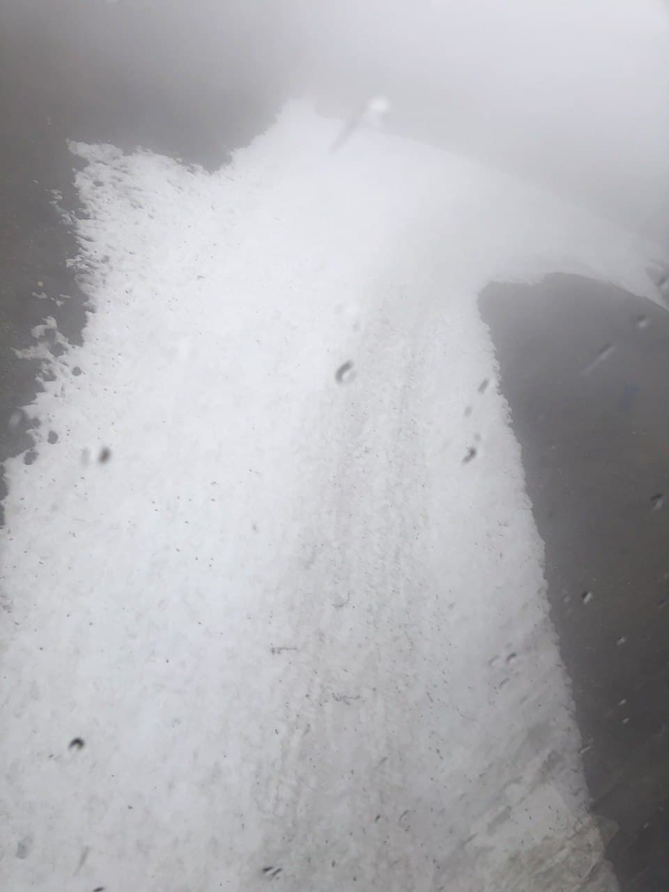

## Plan Your Itinerary Well
One one the main places you can not afford to miss out on is Gabala. It is a hilly area and a nice road trip of 3-4 hours from Baku city. Laden with waterfalls and lakes, the drive is a memorable one. The main attraction is cable car with 2 legs, which will take you to the top of the hills and if you are lucky you will find snow(December to march). Most of the people go there for the fun of snow activities.

## Some other picturesque landmarks
    1. Ataksha fire temple Hindu
    2. Yanardak land of fire
    3. Boulevard carpet museum
    4. Heydar Aliyev center and museum Flame Towers, 3 pointer skyscrapers covered with LED 
    screens
    5. Nizami Street - best in the evening/night
    6. Sederak shopping is best for local markets, has old style different from malls. It is a 
    very big market and you will find all local stuff in very good rates and bargain is allowed.

## Tips to Save the Day
    - Taxis are not expensive and many Indian restaurants available.
    - Better to convert currency in Baku city, where you will get better rate and always carry 
    USD, conversion is 1.7 AZN.

## Other Services
We are here to provide you the best of our services, i.e., for any shopping options, food options and any other travel related support.

## For Best Price
Please contact us and send the inquiry. If you have any questions, feel free to send them to us and we will be providing all possible answers.

<Row>
<Col>

</Col>
<Col>

</Col>
</Row>
<Row>
<Col>

`video: /baku_fire.mp4`

</Col>
</Row>
<Row>
<Col>

</Col>
<Col>

`video: /waterfall.mov`

</Col>

<Col>

</Col>
</Row>
<Row>
<Col>

</Col>
<Col>

</Col>
</Row>
<Row>
<Col>

</Col>
<Col>

</Col>

<Col>

</Col>
</Row>