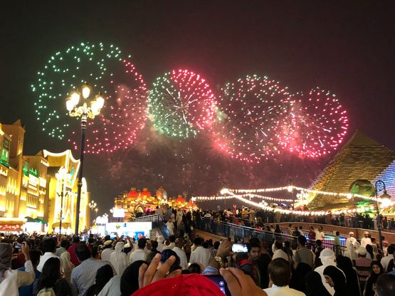
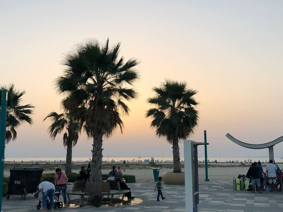
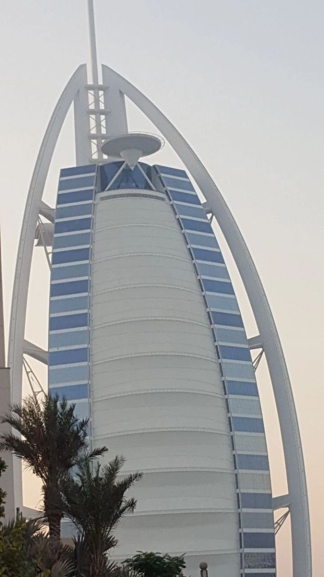

## Detail your services
Group Departures for Dubai with reasonable price and 5* service

## Itinerary
From Airport to Airport and covering main attraction in Dubai with dedicated guide cum manager for your service

## Inclusions in the tour
    1. Both ways flight ticket (Spice Jet)
    2. Tourist VISA charges
    3. Private room in 3 star hotel for 4 days in Dubai City Center
    4. Daily Breakfast
    5. 02 Buffet Dinner with Veg & Non-veg items
    6. Desert Safari with live activities and dinner
    7. Dow-cruise with live activities and dinner
    8. Airport pick-up and drop
    9. Sightseeing by comfortable bus on sharing basis inclusive Burj Khalifa, Dubai Miracle 
    Garden, Dubai Mall, Dubai Aquarium, Underwater Zoo, Gold Souk, Meena Bazar, Burj Al Arab 
    & Palm Jumaira
    10. 30 kg check-in baggage
    11. 7 kg hand baggage
    12. Guide cum representative
    13. Unlimited use of swimming pool in hotel
    14. Unlimited use of Health Club in hotel
    15. Free wi-fi in hotel
    16. 24X7 support of representative
    17. All taxes & service charges

## Departure from Delhi airport
Return on Delhi airport
Fixed departures

## Optional tours with extra price
    1. Bollywood Park
    2. Dubai Safari
    3. Dubai Frame
    4. Ferrari world and Abu Dhabi tour
    5. IMG world
    6. Dubai Glow Garden
    7. Butterfly garden 

## Other Services
We are here to provide you the best of our services, i.e., for any shopping options, food options and any other travel related support.

## For Best Price
Please contact us and send the inquiry. If you have any questions, feel free to send them to us and we will be providing all possible answers.

<Row>
<Col>

</Col>
<Col>

</Col>
</Row>

<Row>
<Col>

</Col>
<Col>

</Col>
</Row>
<Row>
<Col>

`video: /drone.mp4`
</Col>
<Col>

`video: /drone2.mp4`
</Col>
<Col>

`video: /drone3.mp4`
</Col>
</Row>