## Plan Your Itinerary Well
Georgia is a perfect place for a short family trip. It is quite economical and travelling in a group will offer the best experience.

## About the city and places to visit
    1. The currency used in Georgia is Lari
    2. Tbilisi is the capital of Georgia and has a variety of good hotels to stay at. 
    3. Local sight seeing around Tbilisi is a must, especially at night when the city lights 
    up.
    4. For all the Indian food lovers, Sanjha Chulah serves delicious Indian delicacies.
    5. Day trip to Gaduari is a must for nature lovers. Gaduari is nice hilly area 
    and on the way you can have small breaks to capture the beautiful scenic views.
    6. Mtskheta, Uplistsikhe caves on the hill and Kazbegi are some other cool places to visit.
    7. Batumi is another destination and can be covered by road from Tbilisi.

## Tips to Save the Day
    - Carry Euro in case you run out of Lari. Dollar is international so it would be best to 
    have those as well.
    - 

## Other Services
We are here to provide you the best of our services, i.e., for any shopping options, food options and any other travel related support.

## For Best Price
Please contact us and send the inquiry. If you have any questions, feel free to send them to us and we will be providing all possible answers.

<Row>
<Col>

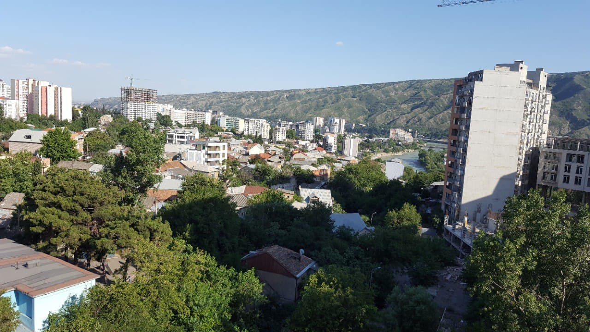

</Col>
<Col>

</Col>
</Row>

<Row>
<Col>

</Col>
</Row>

<Row>
<Col>

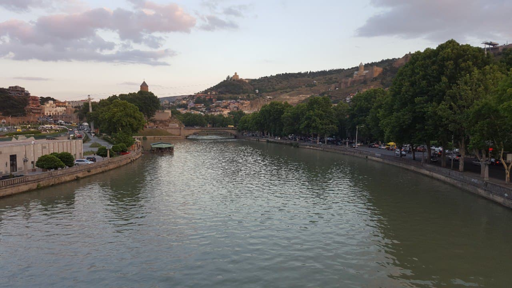

</Col>
<Col>

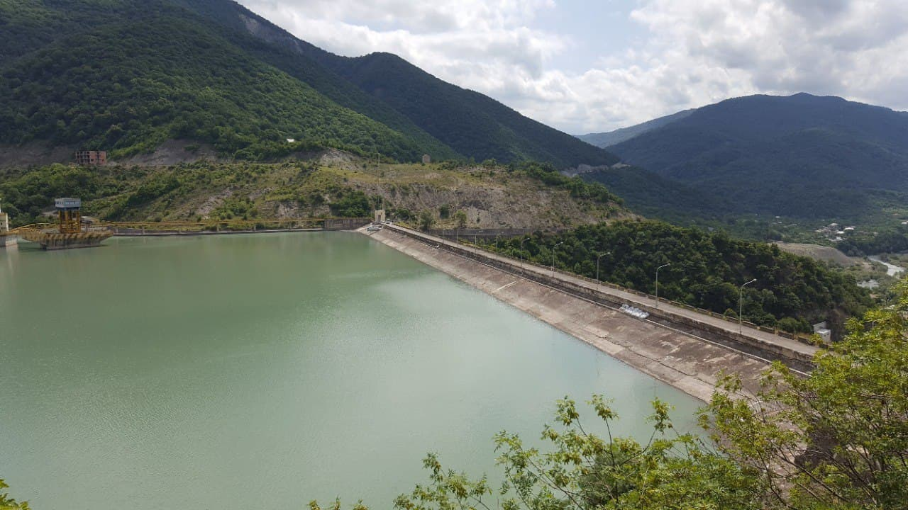

</Col>
</Row>
<Row>
<Col>

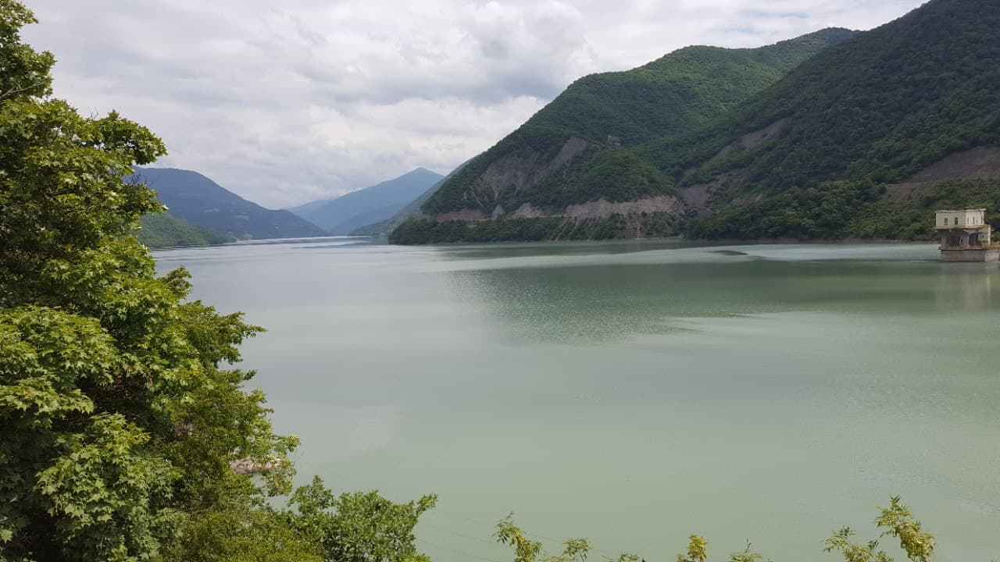

</Col>
</Row>

<Row>
<Col>

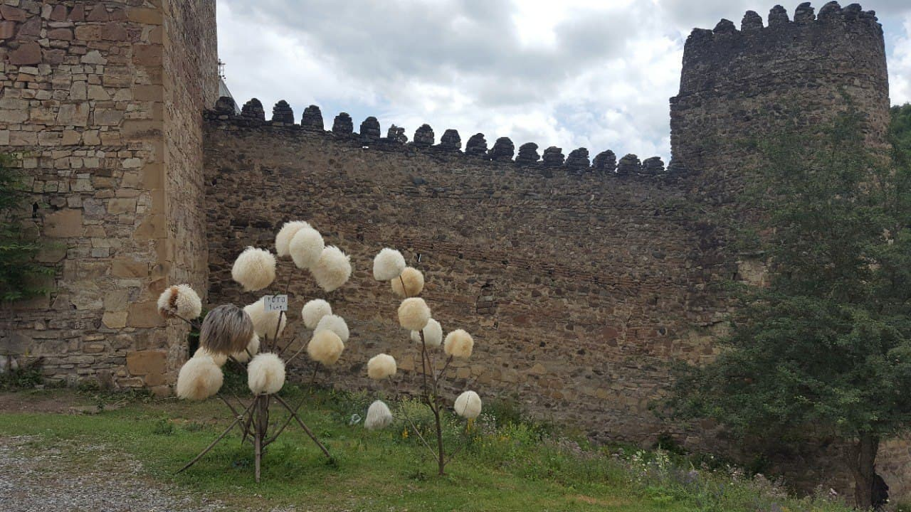

</Col>
<Col>

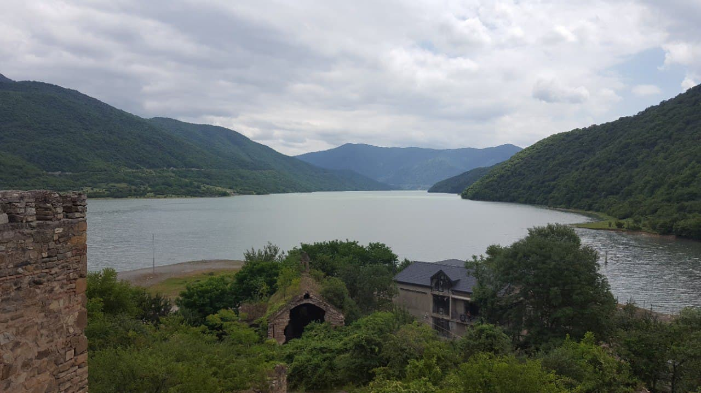

</Col>
</Row>
<Row>
<Col>

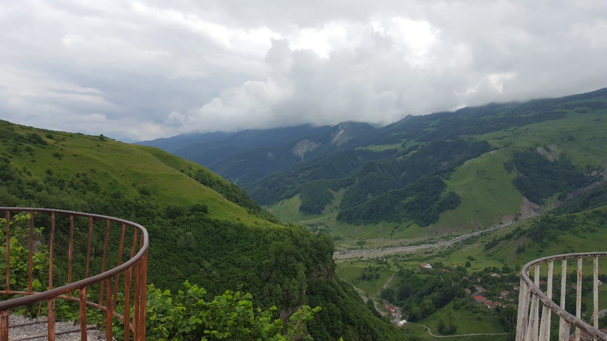

</Col>
</Row>

<Row>
<Col>

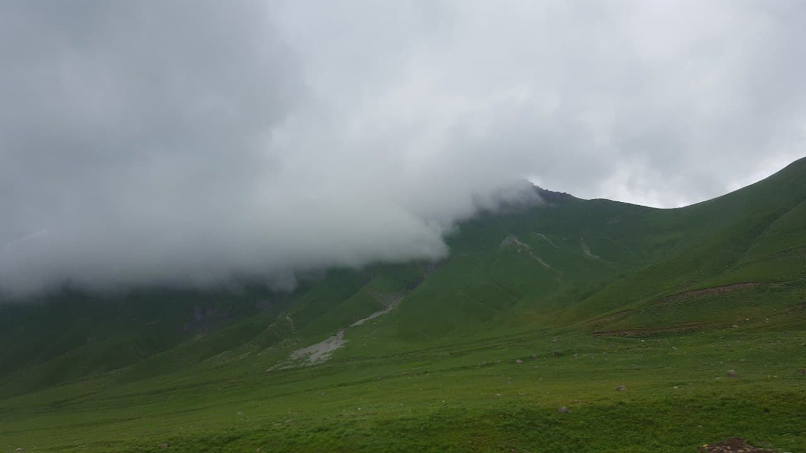

</Col>
<Col>

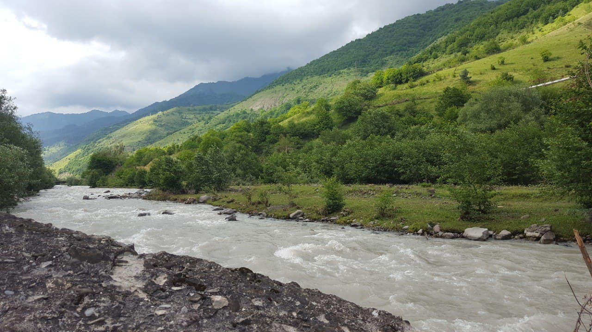

</Col>
</Row>
<Row>
<Col>

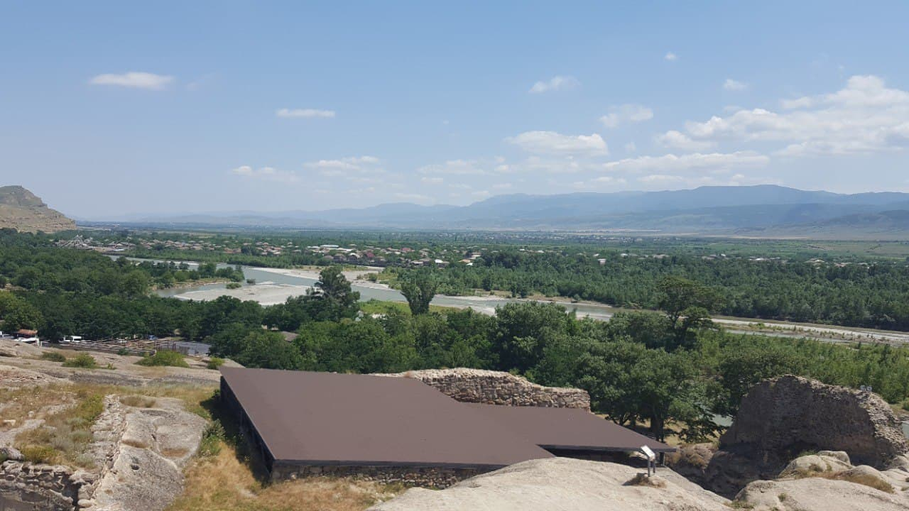

</Col>
</Row>

<Row>
<Col>

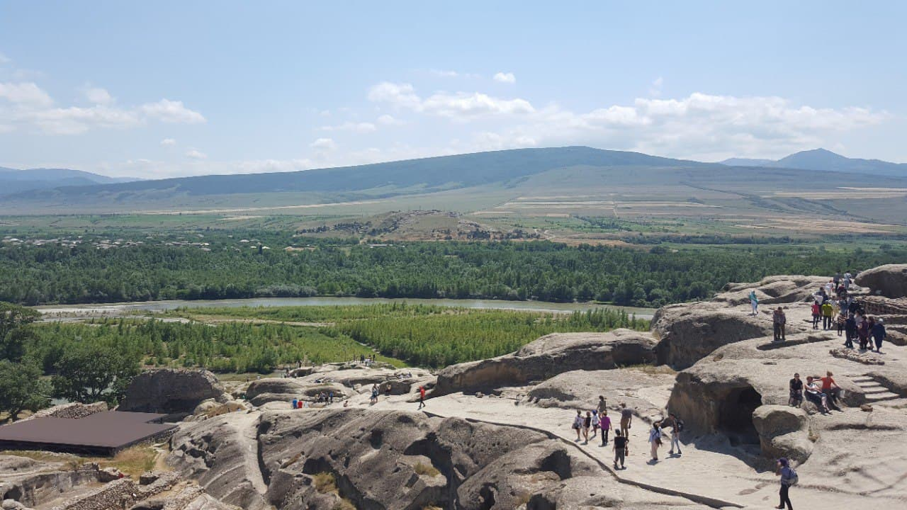

</Col>
<Col>

</Col>
</Row>
<Row>
<Col>

</Col>
</Row>